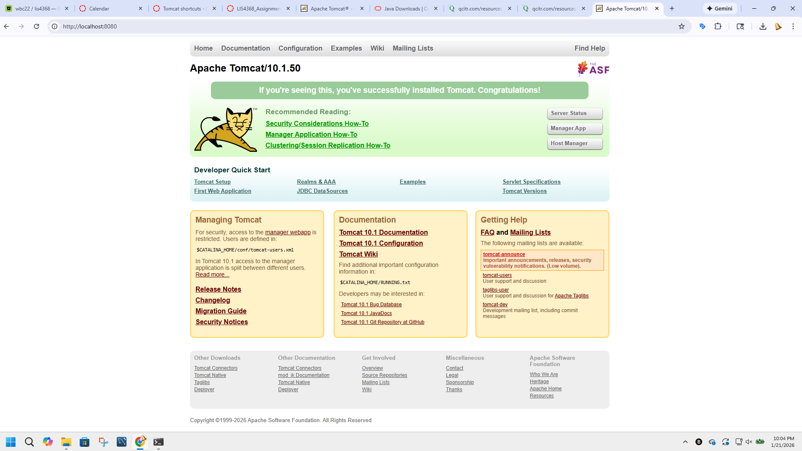
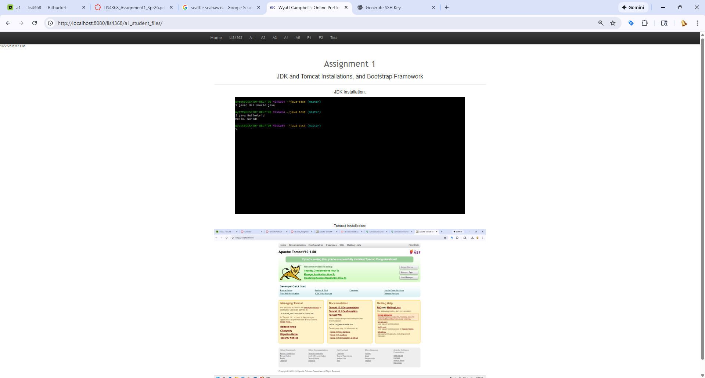

# LIS4368 - Assignment 1

**Wyatt Campbell**

## Assignment Description
This assignment documents the installation and configuration of the development environment for LIS4368, including Git, BitBucket, Java JDK, and Apache Tomcat. It also demonstrates the successful execution of a Java Hello World program and the ability to run a web application locally using Apache Tomcat.

---

## Git Commands Used
Below are the Git commands used during this assignment with brief descriptions.

- **git init** - Initialize a new local Git repository.
- **git status** - Display the current state of the working directory and staging area.
- **git add** - Stage files for commit.
- **git commit** - Save staged changes to the local repository.
- **git push** - Upload local commits to the remote BitBucket repository.
- **git pull** - Fetch and merge changes from the remote repository.
- **git log** - Display the commit history.

---

## Screenshots

### JDK Hello World

### Tomcat running locally

### A1 Page Screenshot
