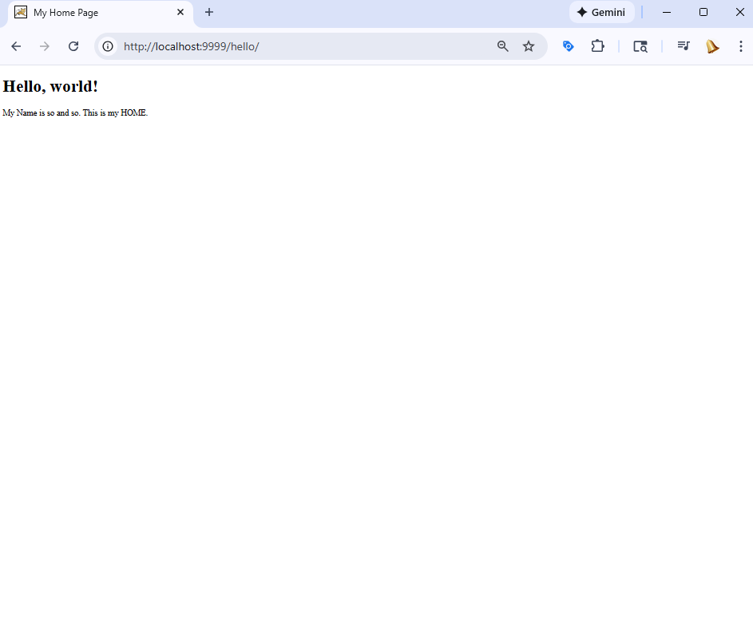
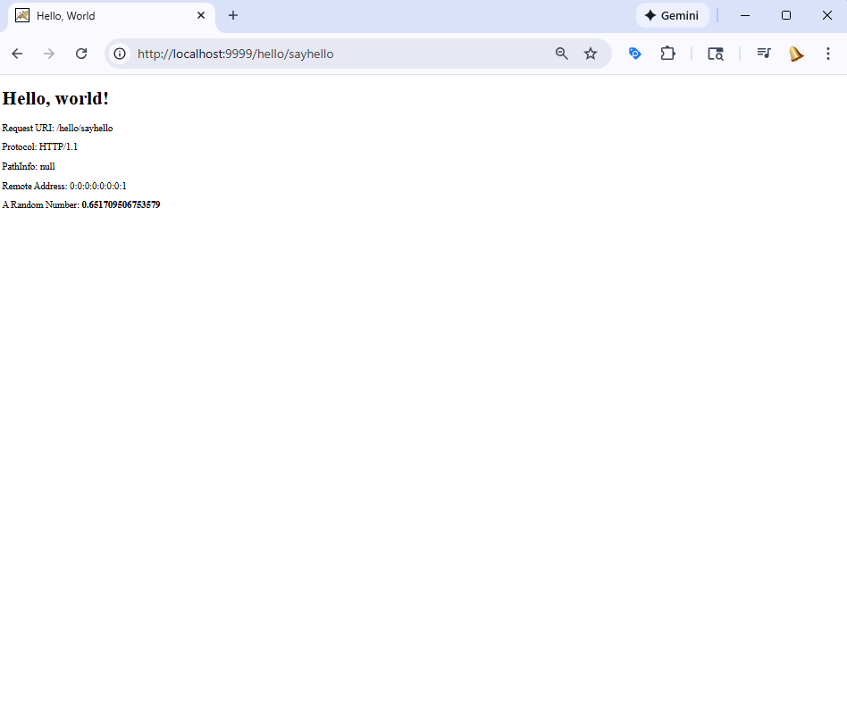
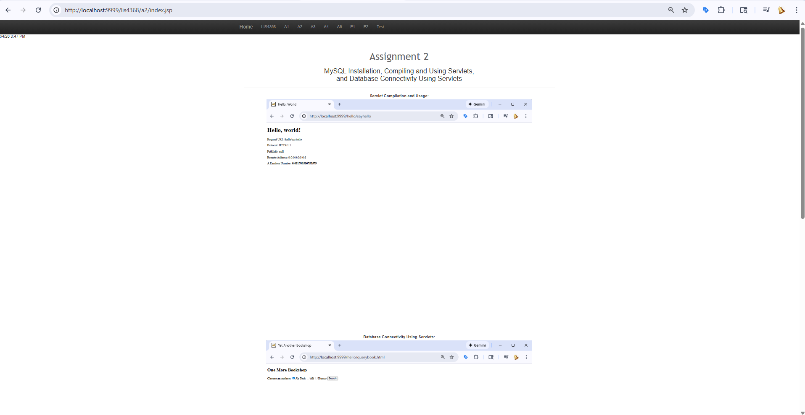
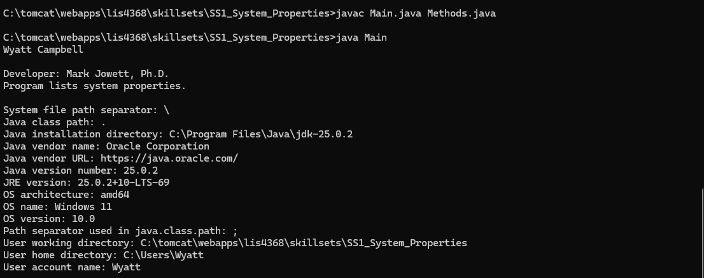
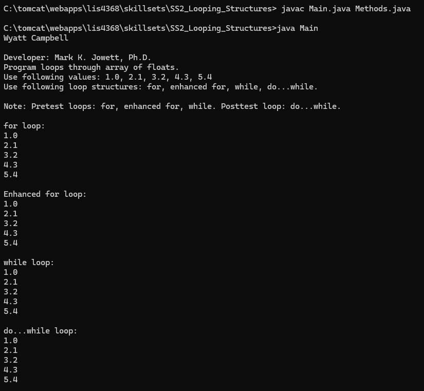
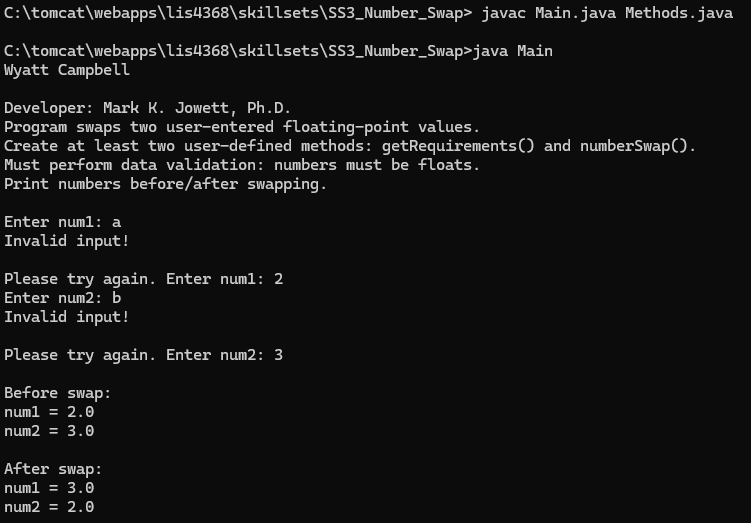

# LIS4368 – Web Application Development

## Wyatt Campbell

### Assignment 2 – Java Servlets & MySQL Integration

This assignment demonstrates a working Java Servlet application deployed on Apache Tomcat that connects to a MySQL database. The application allows users to query a database of books by author and returns results dynamically using a server-side servlet.

---

### Assignment Requirements Completed

1. Apache Tomcat installed and running on port 9999
2. MySQL database (`ebookshop`) created and populated
3. Java servlets compiled and deployed correctly
4. Client-side HTML form submits requests to a servlet
5. Server-side servlet queries MySQL and displays results
6. Screenshots documenting functionality included

---

### Assignment Screenshots

**Hello Home Page**

**Hello Servlet Running**

**Query Form Page**

**Query Results Returned**

**Application Working Confirmation**

---

## Java Skill Sets - Screenshots & Source Code

### Skill Set 1: System Properties
[View Source Code](../skillsets/SS1_System_Properties)

### Skill Set 2: Looping Structures
[View Source Code](../skillsets/SS2_Looping_Structures)

### Skill Set 3: Number Swap
[View Source Code](../skillsets/SS3_Number_Swap)

<table>
  <tr>
    <td align="center">
      <a href="../skillsets/SS1_System_Properties"><b>Skill Set 1: System Properties</b></a>
    </td>
    <td align="center">
      <a href="../skillsets/SS2_Looping_Structures"><b>Skill Set 2: Looping Structures</b></a>
    </td>
    <td align="center">
      <a href="../skillsets/SS3_Number_Swap"><b>Skill Set 3: Number Swap</b></a>
    </td>
  </tr>

  <tr>
    <td align="center">
      
    </td>
    <td align="center">
      
    </td>
    <td align="center">
      
    </td>
  </tr>
</table>

