# LIS 4368 - Advanced Web App Development

## Wyatt Campbell

### Assignment 3 Requirements:

*Deliverables:*

1. Entity Relationship Diagram (ERD)
2. Include Data (at least 10 records each table)
3. Provide Bitbucket read-only access to repo (Language SQL), *must* include README.md,
   using Markdown syntax, and include links to all of the following files (from README.md):
   * docs folder: a3.mwb and a3.sql
   * img folder: a3.jpg (export a3.mwb file as a3.png)
   * README.md (*MUST* display a3.jpg ERD)
4. Canvas Links: Bitbucket repo

---

#### Assignment Screenshots and Links:

*Screenshot A3 ERD:*

[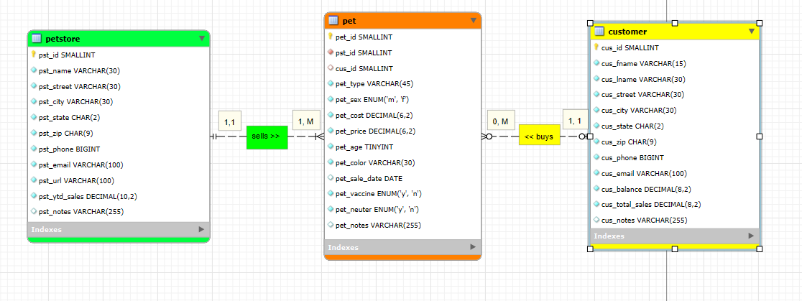](img/lis4368-a3-img-a3working.png)

*Screenshot of 10 Records from each table:*

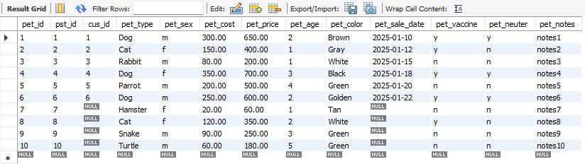

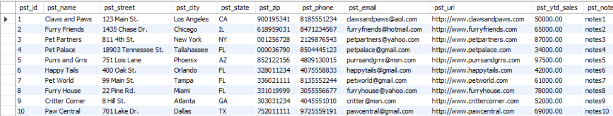

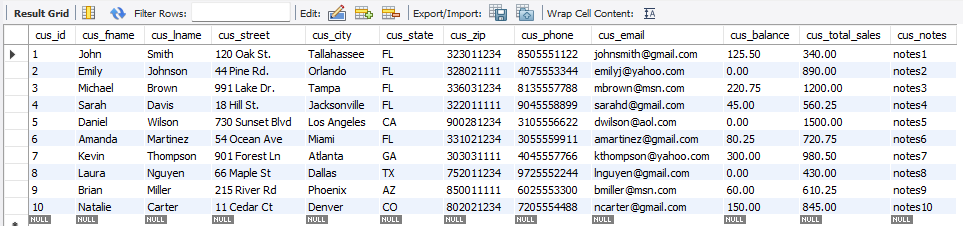

*Screenshot of a3/index.jsp running:*

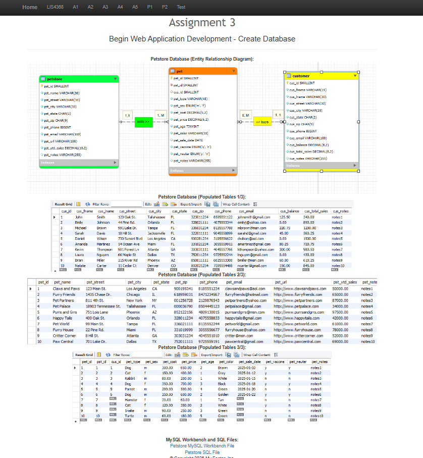

*A3 docs: a3.mwb and a3.sql:*

[A3 MWB File](docs/a3.mwb "A3 ERD in .mwb format")

[A3 SQL File](docs/a3.sql "A3 SQL script")

---

#### Skillsets:

[Skillset 4: Directory Info](../skillsets/SS4_Directory_Info)  |
[Skillset 5: Character Info](../skillsets/SS5_Character_Info)  |
[Skillset 6: Determine Character](../skillsets/SS6_Determine_Character)

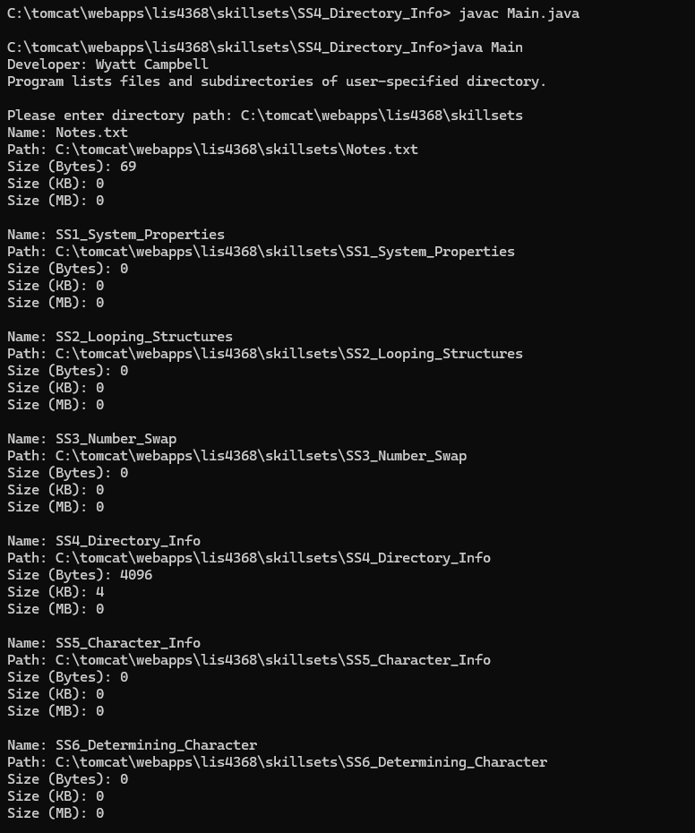
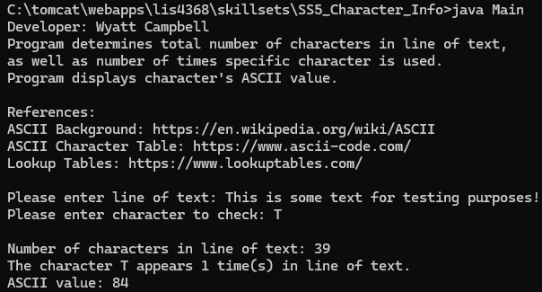
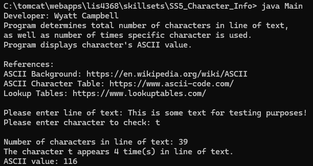
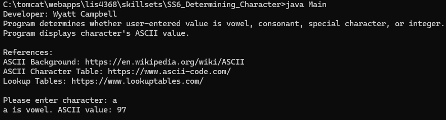
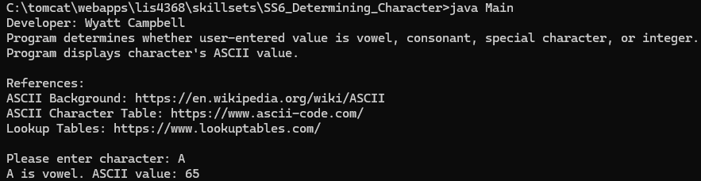
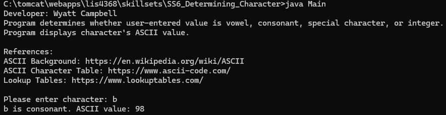
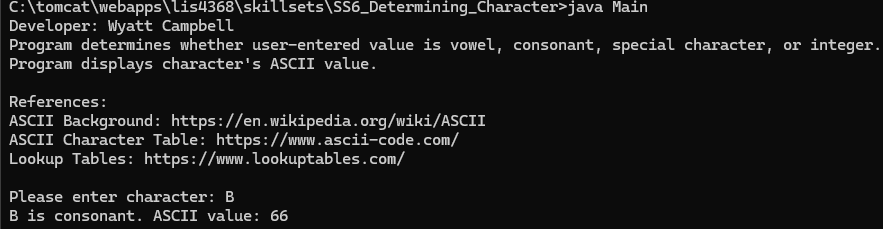
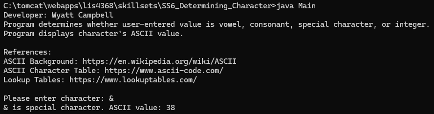
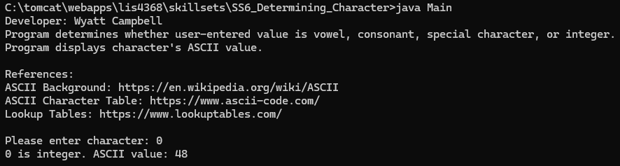

