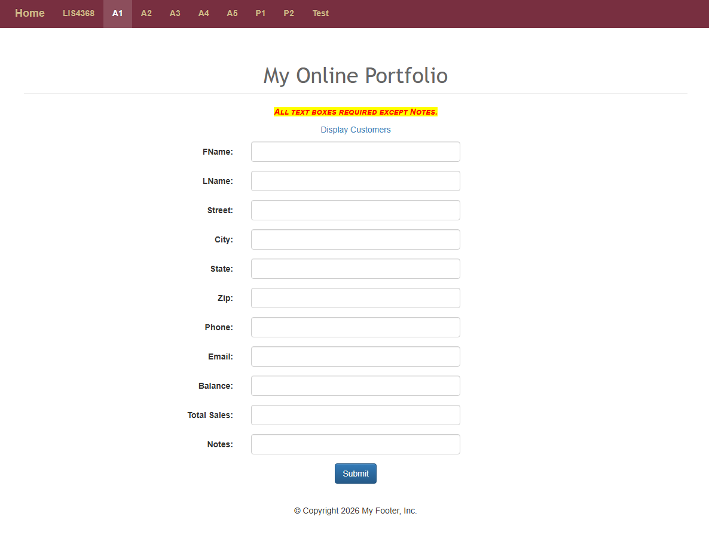
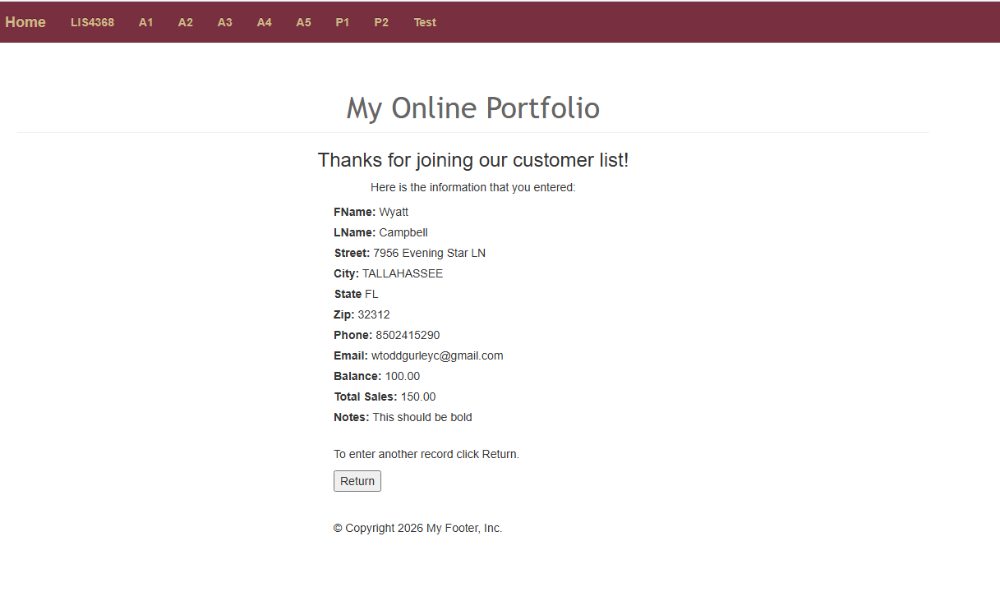
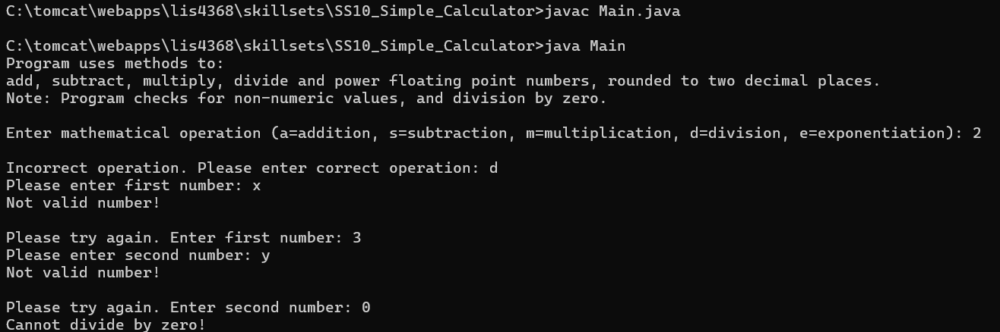
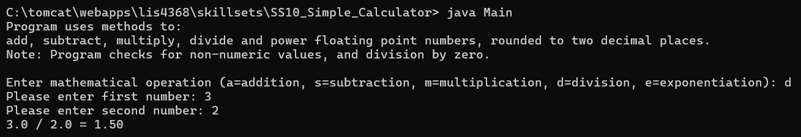
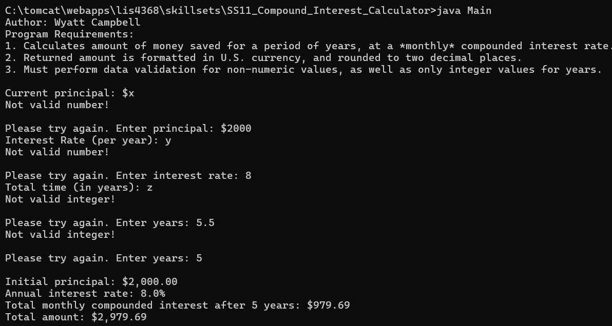
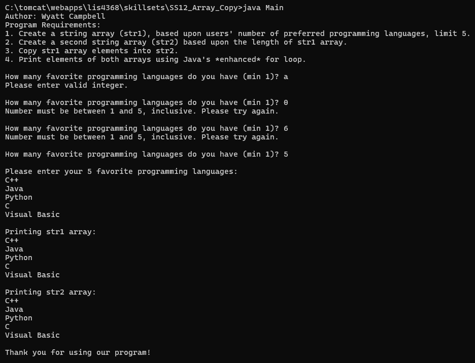

# LIS 4368 - Advanced Web App Development

## Wyatt Campbell

### Assignment 4 Requirements:

Two Parts:

1. Creating server-side validation for web form using Java.
2. Providing matching client-side validation (extra credit).

---

### README.md file should include the following items:

- Screenshot of failed validation
- Screenshot of passed validation
- Modify CustomerServlet.java and Customer.java
- Skillsets 10 - 12

---

### Assignment Screenshots (Note: BE SURE to modify for specific course!):

---

#### Failed Validation:

---

#### Passed Validation:

---

### Skillsets:

#### [Skillset 10: Simple Calculator](skillsets/SS10_Simple_Calculator)

---

#### [Skillset 11: Compound Interest Calculator](skillsets/SS11_Compound_Interest_Calculator)

---

#### [Skillset 12: Array Copy](skillsets/SS12_Copy_Array)

