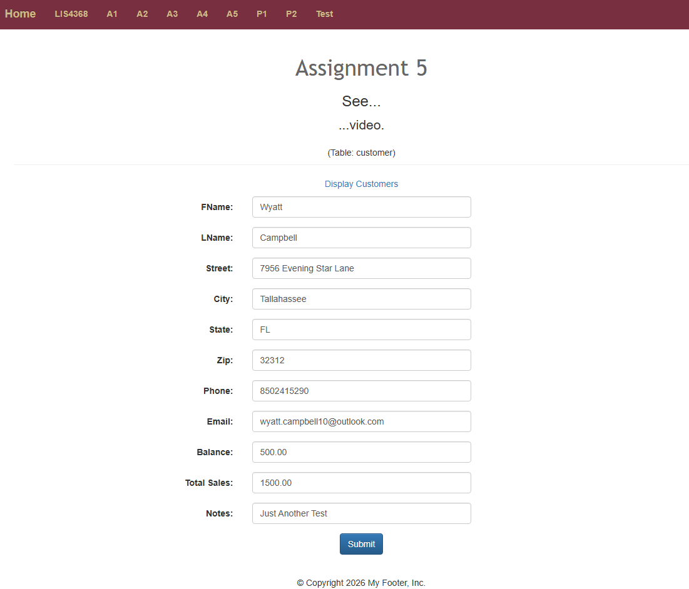
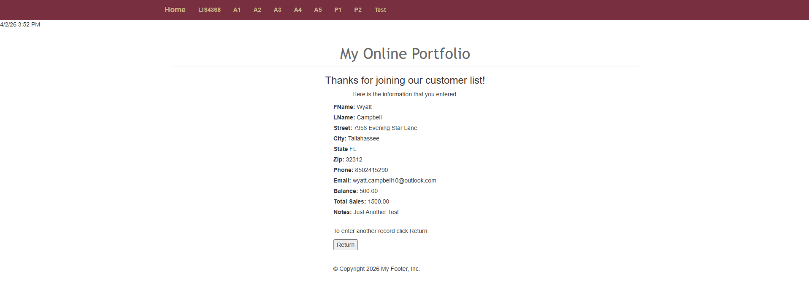
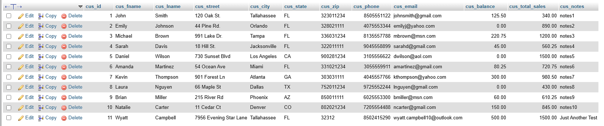
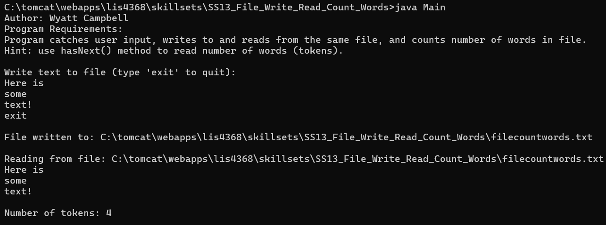

## Wyatt Campbell

### Assignment 5 Requirements:

#### Deliverables (see screenshots below):

1. ***MUST*** provide Bitbucket read-only access to course repo.
2. README.md must include screenshots per assignment instructions.
3. FSU’s Learning Management System: Bitbucket repo link.
4. Include server-side validation and database insert functionality.
---

### Program Requirements:

1. Implemented server-side validation (from Assignment 4).
2. Created customer form with validation (customerform.jsp).
3. Implemented servlet to process form data (CustomerServlet.java).
4. Inserted validated data into MySQL customer table.
5. Displayed user input on confirmation page (thanks.jsp).
6. Used prepared statements to prevent SQL injection.
7. Used JSTL to prevent XSS.

---

#### Assignment 5 Screenshots:

---

##### Valid User Form Entry (customerform.jsp)

---

##### Passed Validation (thanks.jsp)

---

##### Associated Database Entry (MySQL customer table)

---

## Skillsets:

---

### [Skillset 13: File Write Read Count Words](skillsets/SS13_File_Write_Read_Count_Words/)

---

### [Skillset 14: Vehicle Demo](skillsets/SS14_Vehicle_Demo)

---

### [Skillset 15: Car Inherits Vehicle](skillsets/SS15_Car_Inherits_Vehicle)

---
