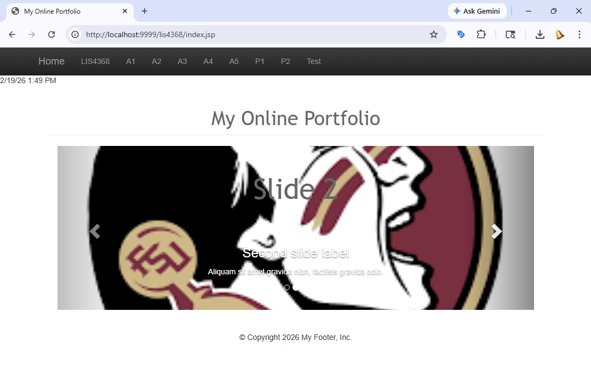
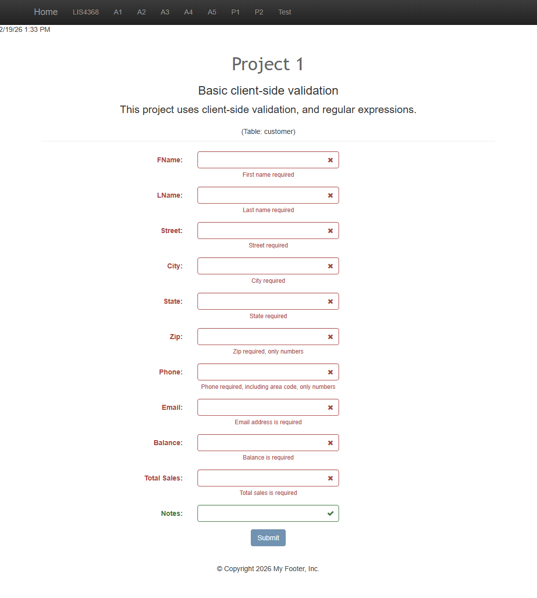
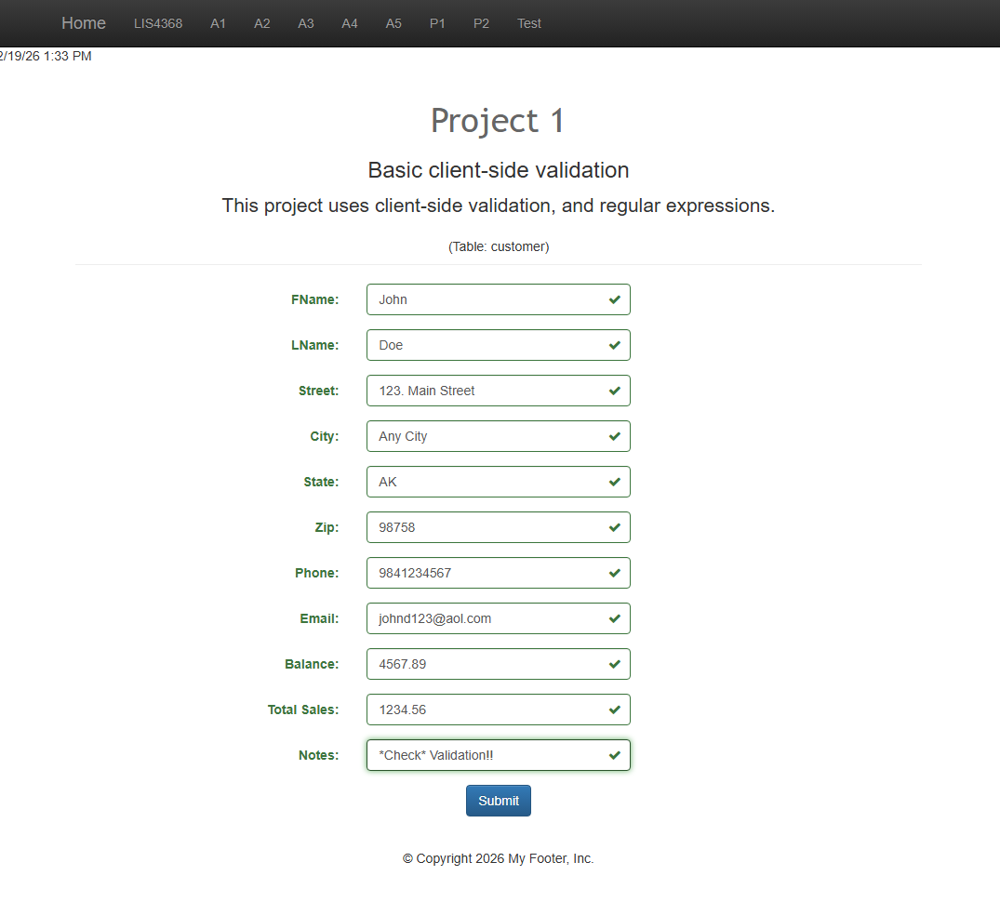
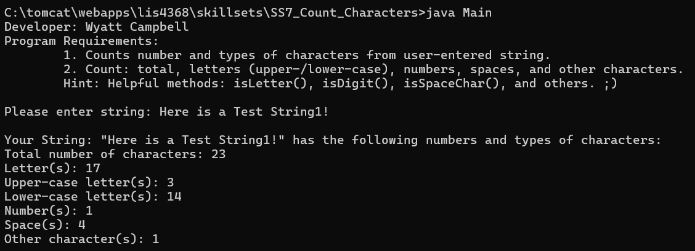
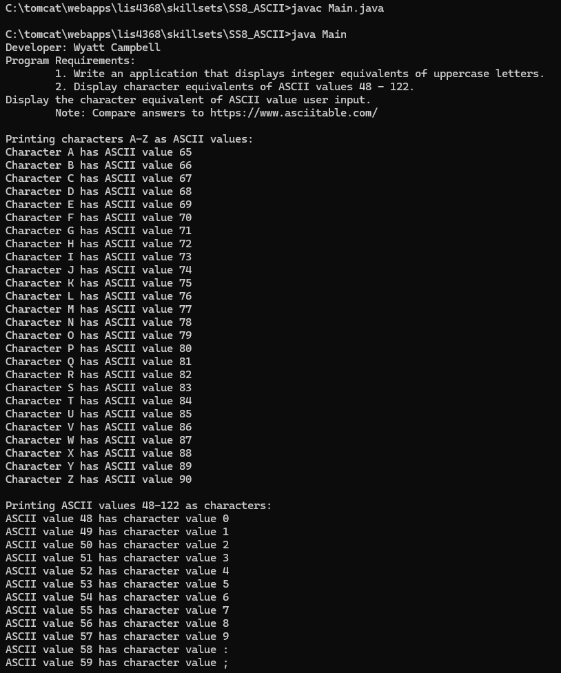
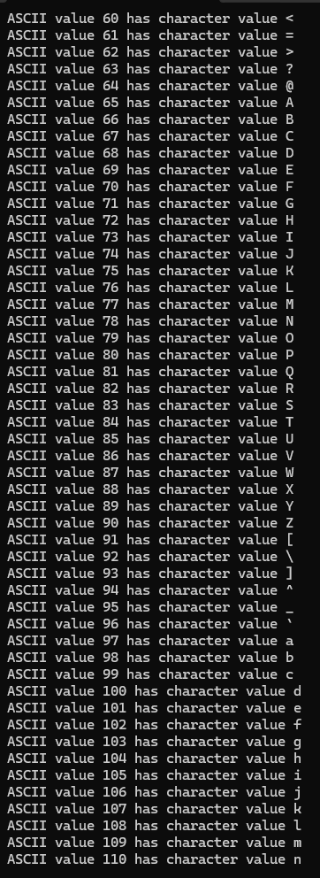
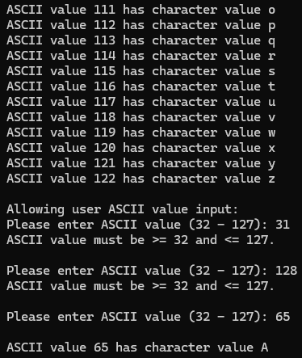
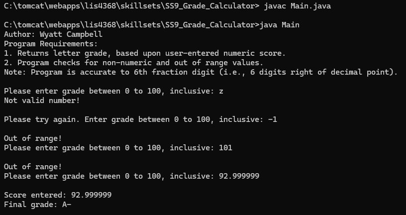

# LIS 4368 - Advanced Web App Development

## Wyatt Campbell

### Project 1 Requirements:

#### Deliverables (see screenshots below):

1. ***MUST*** provide Bitbucket read-only access to course repo.
2. README.md must include screenshots per assignment instructions.
3. FSU’s Learning Management System: Bitbucket repo link.
4. Carousel contains minimum three (3) slides created by student with text and images that link to other content areas promoting skills.
5. Screenshots of working form validation
6. Screenshots and links to working Skillset code 

---

#### Project 1 Screenshots:

---

##### LIS4368 Portal (Main/Splash Page)

---

##### Failed Validation

**Form submission displaying client-side validation errors**

---

##### Passed Validation

**Form submission displaying successful validation**

---

---

---

---

#### Java Skill Sets – Screenshots & Source Code

---

### [Skill Set 7: Count Characters](../skillsets/SS7_Count_Characters)

---

### [Skill Set 8: ASCII](../skillsets/SS8_ASCII)

---

### [Skill Set 9: Grade Calculator](../skillsets/SS9_Grade_Calculator)

---

### Notes

- jQuery validation implemented using FormValidation plugin.
- Regular expressions applied per attribute requirements.
- HTML5 properties added after validation testing.
- Git used to push all p1 files to remote Bitbucket repo.

