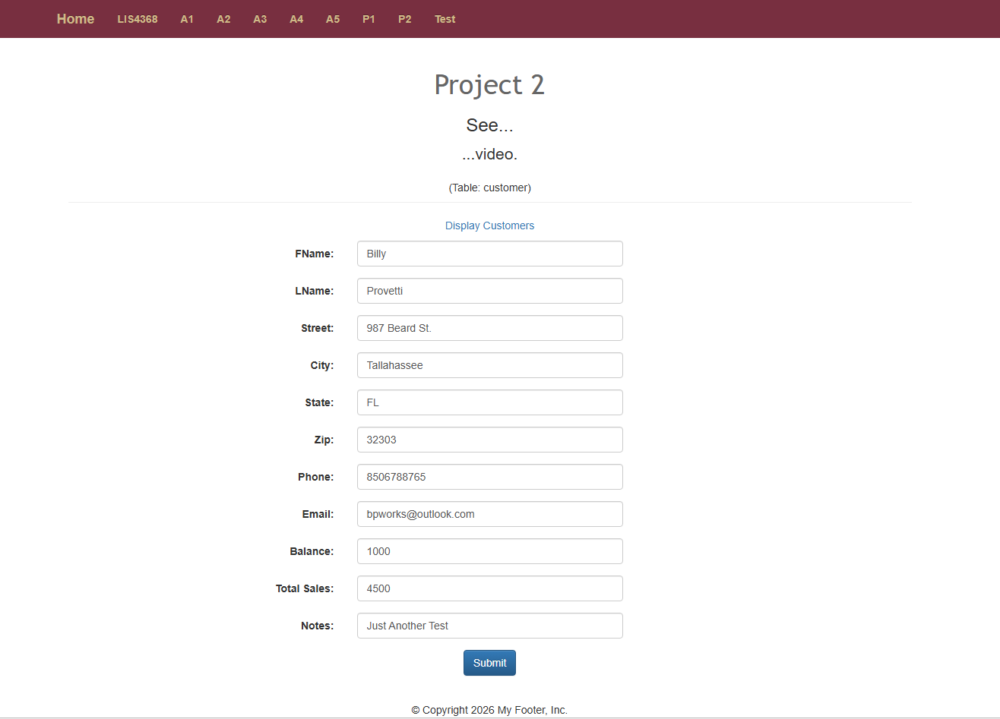
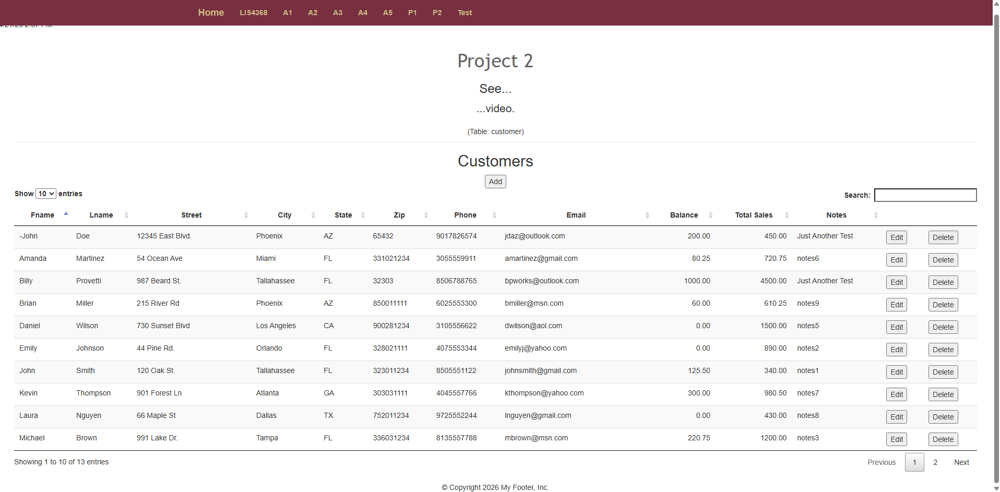
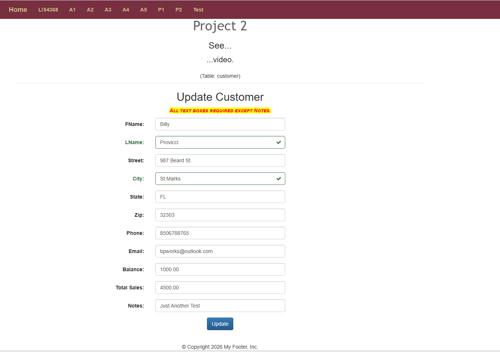
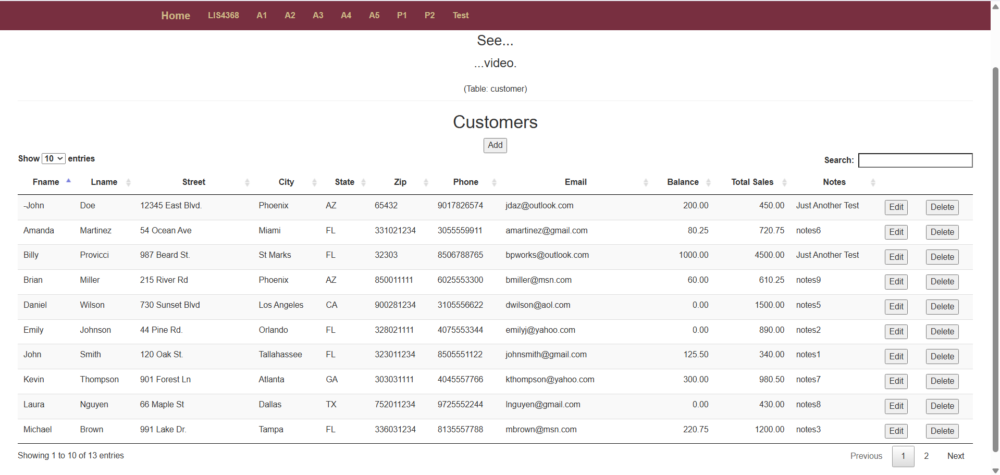
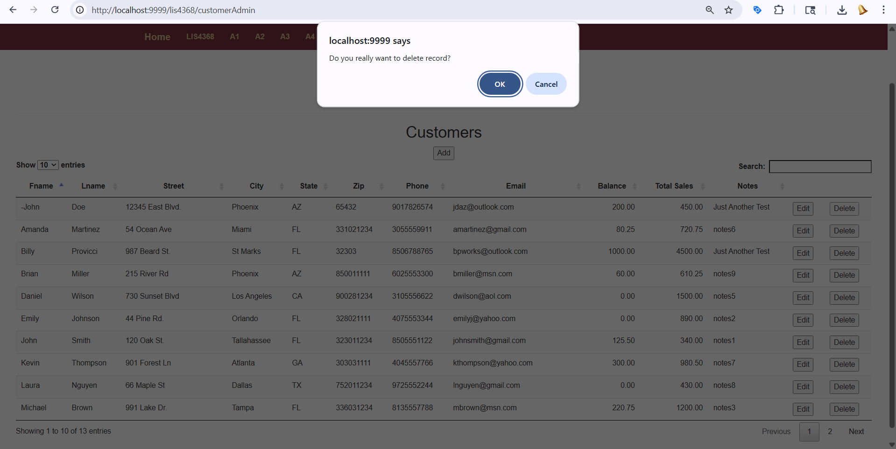
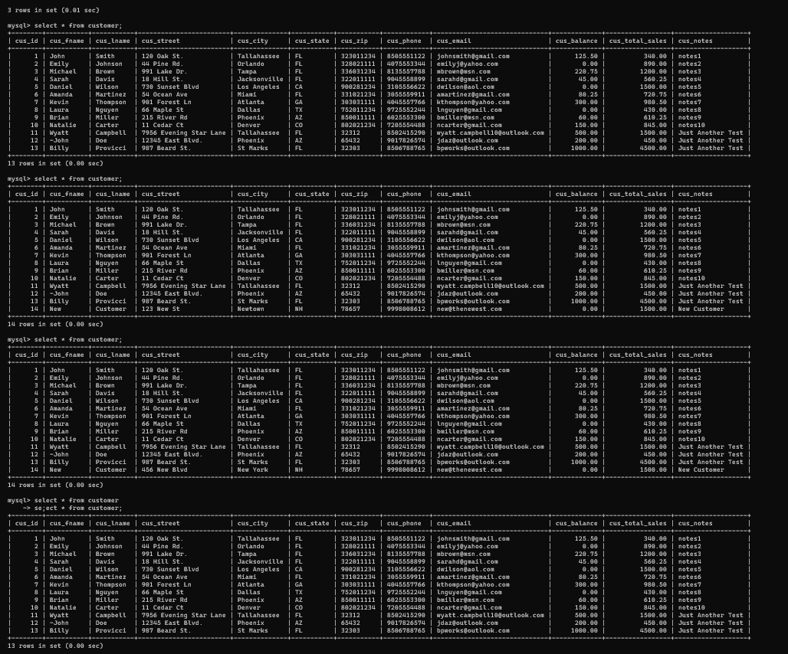

# LIS4368 - Project 2

## Overview
This project implements a JSP/Servlet web application using the MVC framework. It includes full CRUD functionality (Create, Read, Update, Delete) along with server-side validation. Prepared statements are used to prevent SQL injection, and JSTL is used to prevent XSS vulnerabilities.

## Deliverables
- Bitbucket repository link (submitted via Canvas)
- Screenshots demonstrating CRUD functionality and database changes

---

## Screenshots

### Valid User Form Entry

### Passed Validation

### Display Data (Customers Table)

### Modify Form

### Modified Data

### Delete Warning

### Associated Database Changes (SELECT, INSERT, UPDATE, DELETE)

